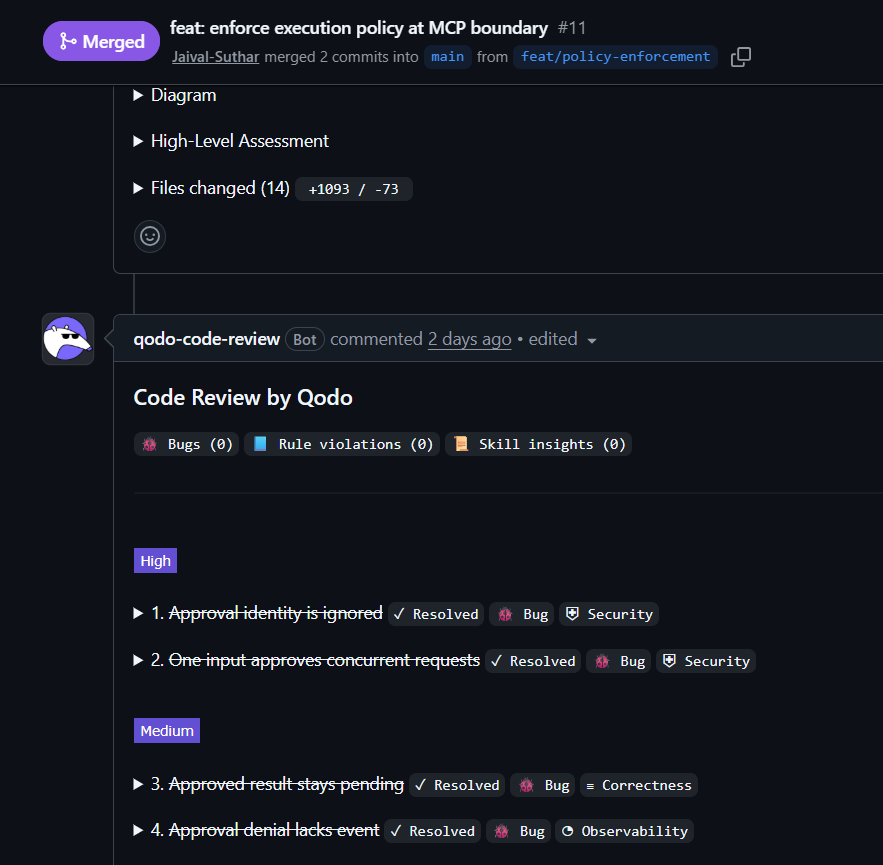
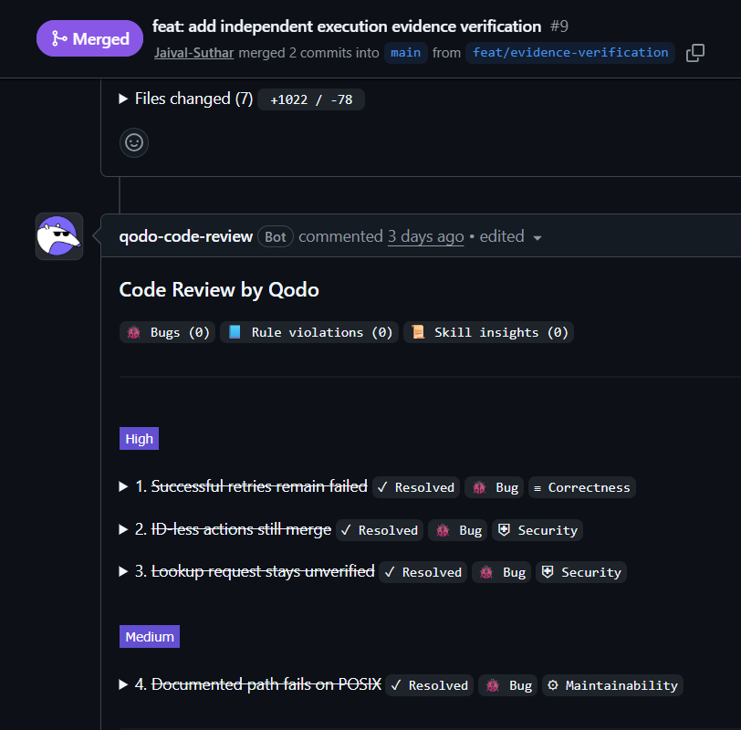
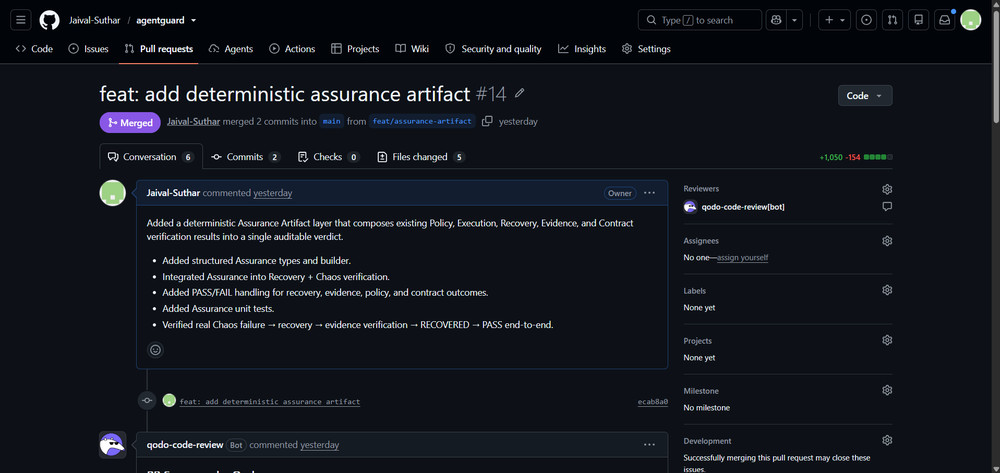
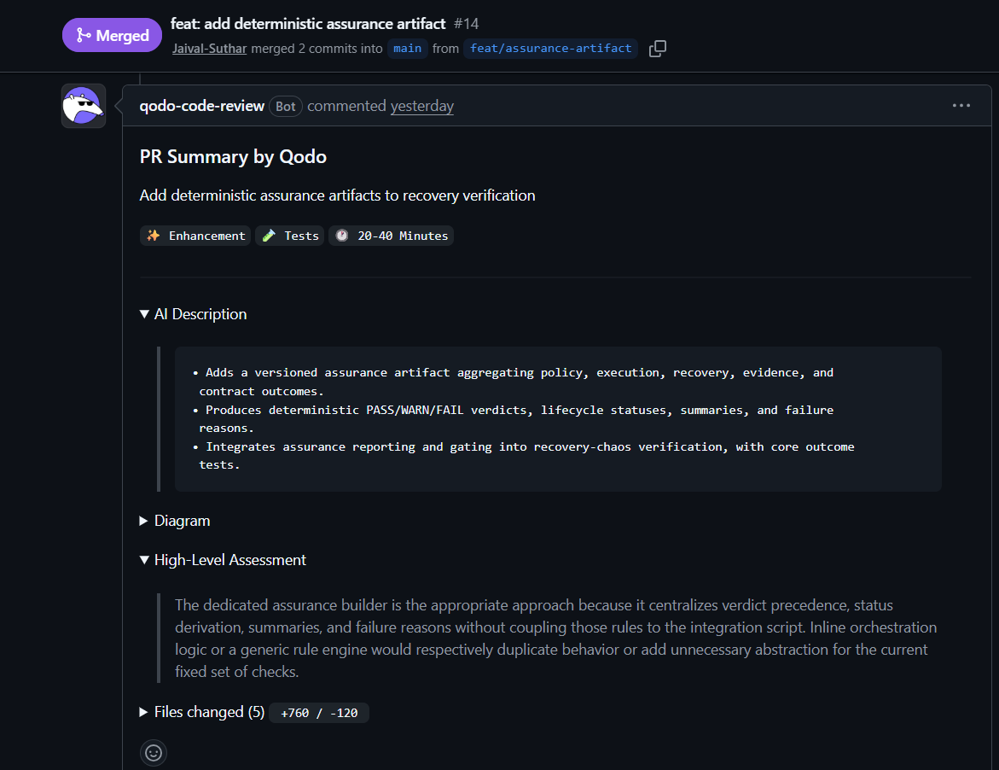
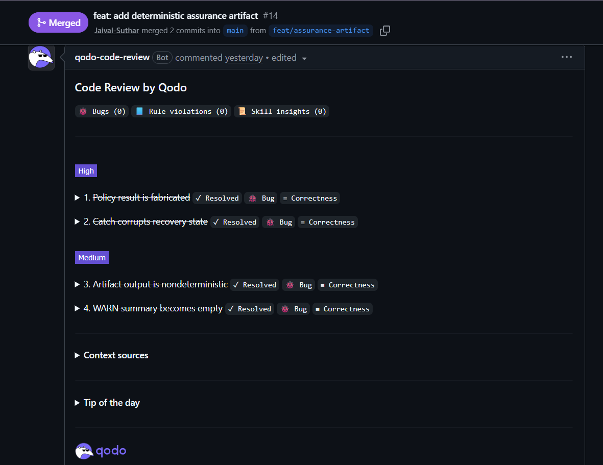
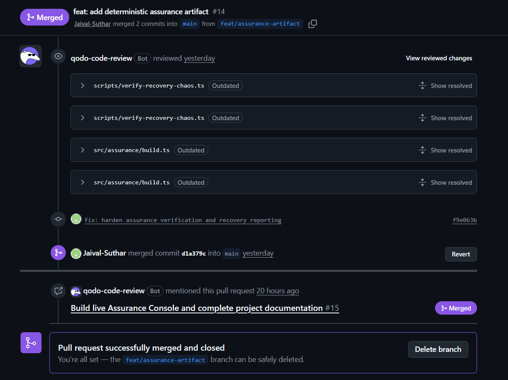

# AgentGuard

### Control the action. Prove the execution.

AgentGuard is a **runtime trust and assurance layer for agentic systems**.

AI agents are increasingly capable of taking consequential actions: calling tools, executing code, modifying state, interacting with external systems, and recovering from failures.

The problem is no longer only *what an agent can do*.

It is:

> **Was the action authorized, what actually happened, and can we prove it without trusting the agent's own narrative?**

AgentGuard sits at that boundary.

**[TrueForge](https://www.truefoundry.com/trueforge) owns execution. AgentGuard owns trust.**

It enforces policy before consequential MCP execution, captures the resulting runtime trajectory, verifies execution contracts and evidence, handles bounded recovery, and produces an authoritative `AssuranceArtifact` that can be independently inspected.

The Assurance Console is the proof surface — **not the source of truth**.

---

## The Core Idea

An agent can say:

```text
"I investigated the incident and fixed it."
```

That statement is not proof.

The runtime may show:

```text
incident.lookup        ✓
sandbox execution     ✓
rollback requested    ✓
rollback denied       ✓
rollback executed     ✗
verification          ✗
```

AgentGuard is designed around a simple principle:

> **An agent's claim is not evidence. The execution trajectory is evidence.**

The system therefore separates:

```text
Agent intent
     ↓
Policy
     ↓
Execution
     ↓
Evidence
     ↓
Contract
     ↓
Recovery
     ↓
Verification
     ↓
Assurance
```

This allows AgentGuard to answer questions that a final model response cannot reliably answer:

* Was the requested action allowed?
* Was human approval required?
* Did the dangerous action actually execute?
* Which tool call produced the observed result?
* Did the execution satisfy its contract?
* Did a retry genuinely recover the operation?
* Does the evidence support the final claim?
* What should the final assurance verdict be?

---

# The Trust Boundary

AgentGuard is deliberately positioned between **agent intent** and **consequential execution**.

```text
                    AGENT
                      │
                      ▼
                ┌─────────────┐
                │  TrueForge  │
                │   Runtime   │
                └──────┬──────┘
                       │
                  MCP / Sandbox
                       │
                       ▼
                ┌─────────────┐
                │ AgentGuard  │
                │             │
                │ PolicyGate  │
                │ Contracts   │
                │ Evidence    │
                │ Recovery    │
                │ Verification│
                │ Assurance   │
                └──────┬──────┘
                       │
                       ▼
                Execution Proof
```

The critical distinction is:

```text
Permission alone:
"Was this action allowed?"

AgentGuard:
"Was it allowed?
 Did it execute?
 What actually happened?
 Did it satisfy its contract?
 What evidence proves that?
 What is the final assurance result?"
```

AgentGuard is therefore not another agent runtime and not simply an observability dashboard.

It is a **control and verification boundary around agent execution**.

---

# Why AgentGuard?

Agentic execution introduces a difficult trust problem.

A successful tool response does not necessarily mean the overall execution succeeded.

A model-generated explanation does not necessarily describe the actual runtime.

A recovery function returning successfully does not necessarily mean the system recovered.

And a dashboard showing `PASS` does not necessarily mean the underlying evidence supports that result.

AgentGuard separates those concerns.

### Before execution

**Policy determines whether an action may proceed.**

```text
MCP request
    ↓
PolicyGate
    ↓
┌───────────────┐
│ ALLOW         │
│ APPROVAL      │
│ BLOCK         │
└───────────────┘
    ↓
Tool Executor
```

### During execution

**AgentGuard captures and normalizes the runtime trajectory.**

### After execution

**Evidence and execution contracts determine whether the observed trajectory satisfies the required conditions.**

### If execution fails

**Recovery is bounded and must itself be verified.**

### Finally

**A deterministic `AssuranceArtifact` becomes the authoritative representation of the result.**

---

# The Most Important Security Property

Consider an agent requesting:

```text
rollback_incident
```

AgentGuard determines:

```text
APPROVAL_REQUIRED
```

The operator denies the request.

A weak system might simply display:

```text
❌ Denied
```

AgentGuard aims to establish the stronger execution fact:

```text
Agent request
      ↓
PolicyGate
      ↓
APPROVAL_REQUIRED
      ↓
Human DENY
      ↓
APPROVAL_DENIED
      ↓
REAL EXECUTOR INVOCATIONS = 0
```

The important property is not the UI message.

It is:

> **The consequential executor was never invoked.**

This makes policy enforcement a real execution boundary rather than an after-the-fact audit signal.

---

# Evidence Over Narrative

AgentGuard treats runtime evidence as the source of truth.

The evidence pipeline is:

```text
TrueForge JSONL
      ↓
Observation Normalizer
      ↓
Event Correlation
      ↓
Evidence Verification
      ↓
Contract Verification
      ↓
PASS / WARN / FAIL
```

The verifier reasons about execution semantics such as:

```text
TOOL_CALL
TOOL_RESULT
SANDBOX
EXECUTION
FAILURE
POLICY
APPROVAL
RECOVERY
```

But recording an event is not enough.

The verifier must establish provenance:

```text
Which action requested this result?

Which tool produced it?

Which result belongs to which call?

Was the result successful?

Was it a retry?

Does it correspond to the required target?

Does the complete trajectory satisfy the contract?
```

This prevents isolated outputs from being mistaken for proof.

---

# Execution Contracts

AgentGuard uses execution contracts to define what a valid execution must establish.

A contract can express requirements around:

* expected actions
* permitted retries
* required evidence
* execution outcomes
* target identity
* recovery behavior

This changes the question from:

```text
Did the agent run?
```

to:

```text
Did the execution satisfy the declared contract?
```

A tool succeeding is not necessarily an execution succeeding.

A retry succeeding is not necessarily a recovery being verified.

And a model saying "done" is never sufficient by itself.

---

# Retries and Recovery

Failures are first-class execution states.

A valid trajectory may look like:

```text
Attempt 1
   ↓
FAIL
   ↓
Recovery
   ↓
Attempt 2
   ↓
SUCCESS
   ↓
Independent verification
```

AgentGuard does not treat recovery as:

```text
failure → retry forever
```

Recovery is bounded by explicit execution constraints.

More importantly:

> **A recovery action is not proof of recovery.**

The resulting execution must be observed and independently evaluated before recovery contributes to the final assurance result.

This distinction prevents a successful repair call from being confused with a successfully recovered system.

---

# Deterministic Assurance

AgentGuard combines several independent signals:

```text
Policy
Execution
Contract
Evidence
Recovery
```

Rather than allowing the UI to combine those signals itself, AgentGuard produces an authoritative `AssuranceArtifact`.

```text
Policy ────────┐
Execution ────┤
Contract ─────┤
Evidence ─────┼──→ Assurance Builder → PASS/WARN/FAIL
Recovery ─────┘
```

The artifact contains the authoritative assurance state for a completed run, including:

* policy result
* execution result
* recovery result
* evidence verification
* contract verification
* summary
* failure reasons
* lifecycle status

The core rule is:

> **The UI does not decide whether an execution passed. The `AssuranceArtifact` does.**

Determinism is also important.

Given the same:

```text
evidence
+
contract
+
policy
```

the assurance system should produce the same logical result.

That makes the output reproducible and independently inspectable.

---

# Assurance Console

The Assurance Console is a human-facing proof surface over the same underlying assurance data.

```text
TrueForge Runtime
       ↓
Run Evidence
       ↓
Live Store
       ↓
REST / SSE API
       ↓
Assurance Console
```

The console provides:

* run discovery
* live run selection
* SSE-backed updates
* bounded semantic execution timeline
* policy events
* tool calls
* evidence inspection
* recovery state
* final assurance artifact
* final verdict

The console intentionally does **not** calculate the final PASS / WARN / FAIL state independently.

It renders the authoritative `AssuranceArtifact`.

This keeps presentation separate from verification.

---

# Architecture

The repository is organized around the following layers:

```text
TrueForge execution
        ↓
Event observation & normalization
        ↓
Policy evaluation / enforcement
        ↓
Execution contracts
        ↓
Chaos / failure handling
        ↓
Bounded recovery
        ↓
Evidence verification
        ↓
Deterministic contract verification
        ↓
AssuranceArtifact
        ↓
Live API / SSE
        ↓
Assurance Console
```

### Repository structure

```text
src/
  assurance/              Final assurance artifact assembly
  contract/               Execution contract loading and types
  events/                 Normalized execution event types
  investigator/           Incident investigation workflow and reporting
  live/                   Live API, run snapshots, SSE stream, store
  policy/                 Policy evaluation and gate logic
  recovery/               Recovery execution and retry logic
  trueforge/              TrueForge integration, adapter, health, probe
  verifier/               Evidence and contract verification

scripts/                   Verification and runtime helper scripts
tests/                     Automated regression tests

tools/chaos-mcp/           Synthetic Chaos MCP server
tools/incident-mcp/        Synthetic incident MCP server

ui/                        React Assurance Console

data/runs/                 Raw run metadata and JSONL evidence
data/assurance/            Generated assurance artifacts

docs/                      Architecture and verification references

docker-compose.assurance.yml
Dockerfile.agentguard
```

---

# Real Runtime Verification

AgentGuard is not based solely on synthetic transcripts.

It uses the real [TrueForge runtime](https://github.com/truefoundry/trueforge) for its MCP execution path.

The golden path is:

```text
TrueForge
   ↓
Real agent
   ↓
Real MCP
   ↓
Real tool
   ↓
Real result
   ↓
Raw runtime evidence
   ↓
AgentGuard verification
   ↓
AssuranceArtifact
```

Captured runs can be independently verified using the repository's verification commands.

---

# Testing and Code Quality

AgentGuard currently has **100+ automated test cases passing**.

The test suite covers the behavior that matters most to the trust boundary, including:

* policy allow / block decisions
* approval-required actions
* approval denial
* approval identity
* missing approval handlers
* MCP policy enforcement
* execution contracts
* retry semantics
* evidence correlation
* ID-less event handling
* evidence provenance
* sandbox execution
* chaos / fault injection
* bounded recovery
* recovery verification
* assurance precedence
* deterministic assurance artifacts
* API integration
* live execution behavior

The goal is not simply to demonstrate the happy path.

The goal is to test the conditions under which an assurance system could otherwise produce a **plausible but incorrect result**.

---

# Qodo — Best Code Quality

AgentGuard used [Qodo](https://www.qodo.ai/) as an active code-review layer throughout development.

The goal was not to use AI review as a replacement for engineering judgment.

Qodo was used to challenge assumptions, identify correctness and security issues, and strengthen the implementation before changes were accepted.

This became particularly valuable in AgentGuard because some of the hardest bugs were not obvious runtime crashes.

They were cases where the system could potentially produce a **credible but incorrect assurance result**.

Three PRs are especially representative.

---

## PR #11 — Policy Enforcement at the MCP Boundary

**PR Link -- [<LINK>](https://github.com/Jaival-Suthar/agentguard/pull/11)**



### What Qodo found

Qodo identified a security issue in the approval flow: an approval response could be accepted based on `approved: true` without sufficiently verifying that the approval belonged to the **exact request being authorized**.

That creates the possibility of a stale, crossed, or otherwise mismatched approval authorizing the wrong action.

Qodo also identified a concurrency problem around shared approval input.

### What changed

The approval flow was tightened so that authorization is associated with the correct execution request, with additional tests covering approval correctness and concurrency behavior.

### Why it was useful

This was directly inside AgentGuard's most important security boundary.

The system is supposed to answer:

> **Was this exact consequential action authorized?**

Qodo helped ensure that the answer could not accidentally become:

> "Some action was approved."

That distinction is critical for a real policy-enforcement system.

---

## PR #9 — Independent Execution Evidence Verification

**PR Link -- [<LINK>](https://github.com/Jaival-Suthar/agentguard/pull/9)**



### What Qodo found

Qodo identified several subtle evidence-correlation issues.

One involved retries:

```text
Attempt 1 → FAIL
Attempt 2 → SUCCESS
```

The verifier could incorrectly remain failed because it selected only the first matching action rather than correctly correlating the successful retry with the contract requirement.

Another involved ID-less events, where separate provider events could accidentally share fallback identity and inherit state from one another.

Qodo also identified an evidence-provenance issue around lookup results: the verifier needed to establish that the correlated request actually asked for the expected target rather than trusting a matching value appearing only in the response.

### What changed

The evidence correlation logic was strengthened and the relevant retry, identity, and provenance cases were covered with additional tests.

### Why it was useful

This review went directly to the central AgentGuard principle:

> **Evidence must be correlated to the action that produced it.**

A result that looks correct in isolation is not enough.

AgentGuard needs to know **where that result came from and whether it actually proves the required execution fact**.

---

## PR #14 — Deterministic Assurance Artifact

**PR Link -- [<LINK>](https://github.com/Jaival-Suthar/agentguard/pull/14)**









### What Qodo found

Qodo identified an especially important correctness issue in the assurance integration.

The recovery/chaos path could provide an `ALLOW` policy result directly to the assurance builder instead of deriving it from the actual policy evaluator.

That meant the final artifact could potentially report:

```text
Policy: PASS
```

without actually evaluating the policy.

Qodo also identified inconsistent recovery state during error handling and a determinism issue caused by artifact timestamps depending on the current clock.

### What changed

The assurance path was changed to use the actual policy evaluation result, preserve the known recovery trajectory correctly, and make artifact generation deterministic with respect to its inputs.

### Why it was useful

This was important because the Assurance Artifact is supposed to be the authoritative representation of what AgentGuard can prove.

An assurance system cannot fabricate one of its own inputs.

> **The final verdict must be derived from the execution evidence — not from a convenient assumption about what happened.**

---

## What Qodo added to the project

These reviews changed more than individual lines of code.

They reinforced a common engineering principle across AgentGuard:

```text
Claim
  ↓
What evidence supports it?
  ↓
Can that evidence be correctly correlated?
  ↓
Can the result be reproduced?
  ↓
Can the system fail closed when proof is insufficient?
```

That is exactly the kind of scrutiny an assurance system needs.

Qodo did not replace testing, runtime verification, or engineering judgment.

It provided another layer of challenge around the assumptions that define the trust boundary.

---

# Golden Path Demo

The primary demonstration shows:

```text
TrueForge
   ↓
Real agent execution
   ↓
AgentGuard captures runtime evidence
   ↓
Policy / evidence / contract verification
   ↓
AssuranceArtifact
   ↓
Assurance Console
```

The operator should be able to see:

1. The real execution.
2. The normalized execution trajectory.
3. Policy decisions.
4. Tool calls and results.
5. Evidence verification.
6. Recovery behavior where applicable.
7. The authoritative Assurance Artifact.
8. The final assurance verdict.

### Failure / recovery path

```text
Chaos
  ↓
Failure
  ↓
Bounded recovery
  ↓
Retry
  ↓
Observation
  ↓
Independent verification
  ↓
Final assurance
```

---

# Running Locally

## Prerequisites

* Node.js `>=22.14.0`
* npm
* TrueForge access for the real workflow
* Docker and Docker Compose for the documented container path

The repository does not require a global TypeScript installation. Commands are provided through npm scripts.

## Installation

```powershell
npm install
npm install --prefix ui
```

---

## Start TrueForge

The repository supports the upstream TrueForge runtime through the helper scripts under `scripts/` or the standalone runtime.

For the documented Docker path:

```text
TrueForge host URL: http://localhost:8791
TrueForge container port: 8790
```

---

## Start the AgentGuard API

```powershell
npm run api:dev
```

The API listens on:

```text
http://localhost:8780
```

Useful endpoints:

```text
GET /healthz
GET /api/runs
GET /api/runs/:runId
GET /api/runs/:runId/events
```

---

## Start the Assurance Console

```powershell
npm run ui:dev
```

The Vite development server listens on:

```text
http://localhost:5174
```

Open:

```text
http://localhost:5174
```

---

# Running the Real TrueForge Workflow

Configure the environment from `.env.example`.

Relevant values include:

```text
TRUEFORGE_BASE_URL=http://localhost:8791
TRUEFORGE_MODEL_NAME=<configured provider/model>
TRUEFORGE_AGENT_NAME=<saved TrueForge incident investigator agent>
TRUEFORGE_INCIDENT_ID=INC-042
TRUEFORGE_MCP_SERVER_NAME=incident.lookup.chaos
```

Then:

```powershell
npm run investigate:incident
```

The command writes raw run evidence under:

```text
data/runs/<run-id>.jsonl
```

and run metadata under:

```text
data/runs/<run-id>.json
```

Optional sandbox mode:

```powershell
npm run investigate:incident:sandbox
```

---

# Verification Commands

| Command                                                       | Purpose                                                      |
| ------------------------------------------------------------- | ------------------------------------------------------------ |
| `npm test`                                                    | Runs the automated test suite — currently 100+ tests passing |
| `npm run typecheck`                                           | Type-checks the repository                                   |
| `npm run ui:typecheck`                                        | Type-checks the Assurance Console                            |
| `npm run ui:build`                                            | Builds the Assurance Console                                 |
| `npm run trueforge:health`                                    | Checks TrueForge connectivity                                |
| `npm run trueforge:probe`                                     | Records a real TrueForge turn                                |
| `npm run investigate:incident`                                | Runs the real incident workflow                              |
| `npm run verify:real-mcp -- data/runs/<run-id>.jsonl`         | Verifies a captured MCP trajectory                           |
| `npm run verify:evidence -- data/runs/<run-id>.jsonl INC-042` | Verifies the evidence chain                                  |
| `npm run verify:policy`                                       | Exercises policy enforcement                                 |
| `npm run verify:recovery-chaos`                               | Runs recovery / chaos verification                           |
| `npm run assurance:export -- data/runs/<run-id>.jsonl`        | Builds an Assurance Artifact                                 |

---

# Evidence and AssuranceArtifact

Raw execution evidence lives under:

```text
data/runs/
```

Authoritative assurance output lives under:

```text
data/assurance/
```

The `AssuranceArtifact` contains the final structured representation of the assurance result, including:

```text
version
runId
contract
incidentId
status
verdict
policy
execution
recovery
evidence
contractVerification
summary
failureReasons
generatedAt
```

The artifact is the authoritative summary of the AgentGuard assurance decision for a completed run.

The UI renders this artifact rather than independently deciding the verdict.

---

# Dockerized Path

The repository includes an optional compose configuration:

```text
docker-compose.assurance.yml
```

Services include:

```text
agentguard-api
assurance-ui
agentguard-runner
```

Commands:

```powershell
npm run docker:assurance:up
npm run docker:assurance:run
npm run docker:assurance:down
```

The compose path publishes:

```text
AgentGuard API       8780
Assurance Console    5174
```

The optional runner uses the host-gateway mapping to reach the host-published TrueForge service.

---

# Security Model

See `SECURITY.md` for the detailed security guidance.

The core rules are:

* keep agent experiments isolated
* use synthetic data only
* do not mount personal home directories into containers
* do not expose credentials or `.env` files to agent-facing processes
* treat the UI as untrusted for verdict decisions
* keep authorization and assurance logic inside AgentGuard
* treat the `AssuranceArtifact` as the authoritative result

The goal is to make the trust boundary explicit rather than hiding it behind the presentation layer.

---

# Future Work

The current system intentionally keeps its scope focused.

A few natural extensions are:

### Model-agnostic runtime adapters

Extend the assurance boundary beyond the current TrueForge integration toward additional agent runtimes and MCP environments.

### Environment discovery

Identify potentially state-changing or irreversible tools and propose candidate policies for operator validation.

The important constraint is that discovery should **propose**, not silently rewrite the deterministic assurance core.

### Execution lineage

For long-running agents, reconstruct the complete relationship between:

```text
Task
 ↓
Plan
 ↓
Tool calls
 ↓
Retries
 ↓
Execution
 ↓
State changes
 ↓
Verification
 ↓
Final claim
```

This could eventually allow AgentGuard to identify cases where an agent's final statement is not supported by its execution evidence.

---

# Project Status

| Area                             | Status                       |
| -------------------------------- | ---------------------------- |
| Core AgentGuard pipeline         | Implemented and tested       |
| TrueForge integration            | Implemented                  |
| Real MCP execution               | Implemented and verified     |
| Policy enforcement               | Implemented and tested       |
| Execution contracts              | Implemented and tested       |
| Evidence verification            | Implemented and tested       |
| Chaos / recovery                 | Implemented and tested       |
| Deterministic Assurance Artifact | Implemented and tested       |
| Live API / SSE                   | Implemented                  |
| Assurance Console                | Implemented and type-checked |
| Automated tests                  | **100+ passing**             |
| Dockerized assurance path        | Implemented                  |
| Additional runtime adapters      | Future work                  |

---

# Final Takeaway

Agentic systems are moving from:

```text
generate text
```

toward:

```text
observe
reason
act
retry
modify
recover
```

As agents become more capable, capability alone is not enough.

The harder question is:

> **How do we trust the execution?**

AgentGuard approaches that problem by creating a boundary around consequential agent actions:

```text
Intent
  ↓
Policy
  ↓
Execution
  ↓
Evidence
  ↓
Contract
  ↓
Recovery
  ↓
Verification
  ↓
Assurance
```

The philosophy is simple:

> **Don't trust what the agent says it did. Prove what actually happened.**

**TrueForge makes the agent capable of acting. AgentGuard makes those actions observable, governable, verifiable, and accountable.**
